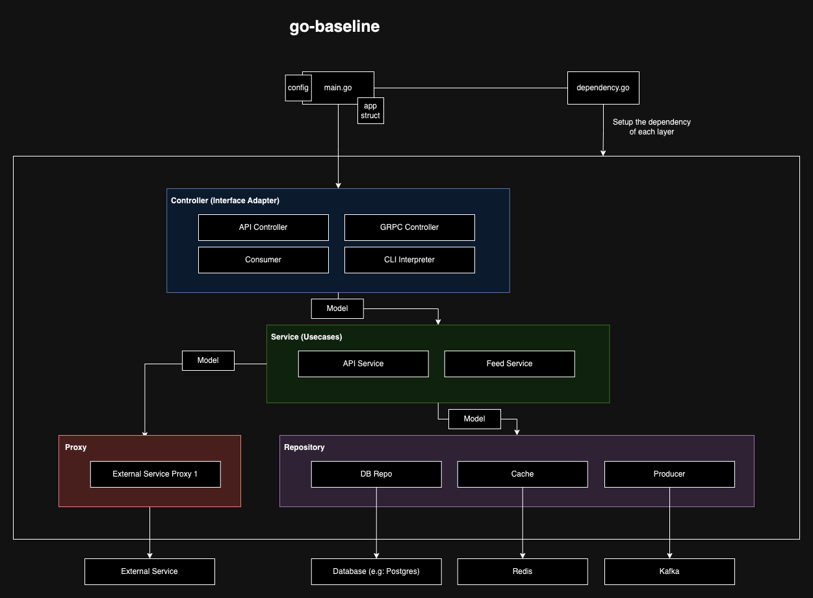

# Go-Baseline
## About the Service
This is a go-baseline project that aims as a starting line for Go project. The concept of this baseline is trying to implement [Uncle Bob's Clean Code Architecture](https://blog.cleancoder.com/uncle-bob/2012/08/13/the-clean-architecture.html) combined with the experience from past projects. 
Project is using drivers/adapters from [https://github.com/dityuiri/go-adapter](https://github.com/dityuiri/go-adapter).

## Architecture


## Project Directory
```
go-baseline
| application
  <App starter and dependency injector>
--| app.go
  <Application builder that holds needed adapters used in the service>
--| dependency.go
  <Dependencies injector that constructs each layer of the service>

| common
  <Shared functions and variables like constant, utility function, error code etc.>
--| util
  <Helper functions goes here>
--| alias.go
  <Function aliasing. For unit testing etc.>
--| constants.go
  <Constant variables used in this service>
--| errors.go
  <Error types and messages>

| config
  <App configuration and environment variables>
--| {environment}.env
  <App configuration stored in environment variables>
--| config.go
  <Configuration constructor>
  
| controller
  <Interface adapters a.k.a the handler like API endpoint controller, message consumer, command line runner etc.>
--| common.go
  <Common functions used in controller/handler layer>
--| consumer.go
  <Handler for kafka consumer>
--| health_check.go
  <REST API for health checking. Example usage for kubernetes' readiness and liveness>
--| placeholder.go
  <Example implementation of REST API with GET and POST method>

| mock
  <Mock for all the interfaces in the project. Unit-testing purpose>
  
| model
  <Entities layer that can consist of DAO and DTO>
--| alpha
  <Example of model used for proxy. Named after the proxy's service name>
----| alpha_placeholder.go
  <Example of the model used for the proxy. Should be named like {proxy's name}_{entity}.go>
--| common.go
  <Common functions used in model layer>
--| placeholder_dao.go
  <Example of Data Access Object's model representation used internally>
--| placeholder_dto.go
  <Example of Data Transfer Object's model representation used internally>

| proxy
  <Proxy client to external services>
--| alpha_client.go
  <Example of proxy client for a service called alpha>
  
| repository
  <Repository layer to interact with data storage such as db, redis, or even kafka>
--| health_check_db.go
  <Health checking repository function. Can be utilized to helath check database>
--| placeholder_cache.go
  <Example of caching implementation. Naming should be {domain/entity}_cache.go>
--| placeholder_db.go
  <Example of repository to db implementation. Naming should be {domain/entity}_db.go>
--| placeholder_producer.go
  <Example of kafka producer implementation. Naming should be {domain/entity}_producer.go>
  
| service
  <Use cases layer. Business logic goes here>
--| health_check.go
  <Health check main logic>
--| placeholder.go
  <Example of main logic for a certain usecase. Naming should be {domain/entity}.go>
--| placeholder_feed.go
  <Example of main logic for usecase that act as subscriber. In this case, kafka consumer. Naming should be {domain/entity}_feed.go}
  
| Dockerfile
| docker-compose.yml
| main.go
  <Main go file that runs the whole service. Initiation of application and dependency goes here>
| Makefile
| entrypoint.sh
```
## Setting Up and Run
1. Set up local environment variables and run locally (based on `/config/local.env`)
    ```sh
    $ make run
    ```
2. Run test
    ```sh
    $ make test
    ```
3. Run test with coverage
    ```sh
    $ make test-coverage
    ```
4. Run golangci-lint
    ```sh
    $ make lint
    ```

## End to End Run
1. Run the service locally with your environment variables
    ```sh
    $ make run
    ```
   
    or run on docker container
   ```sh
   $ docker compose up
   ```
